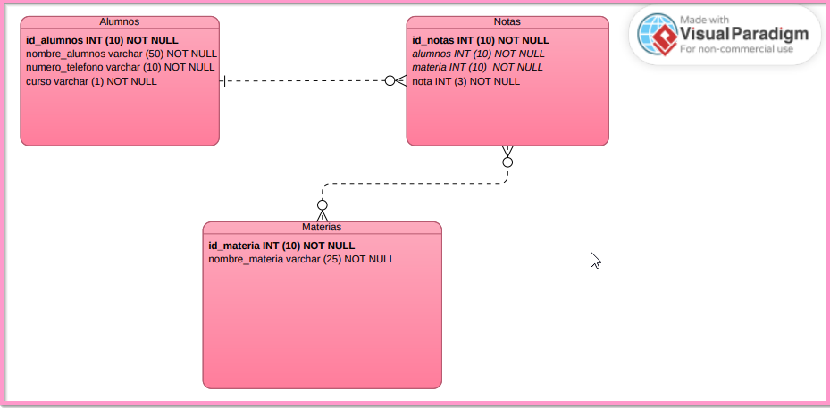
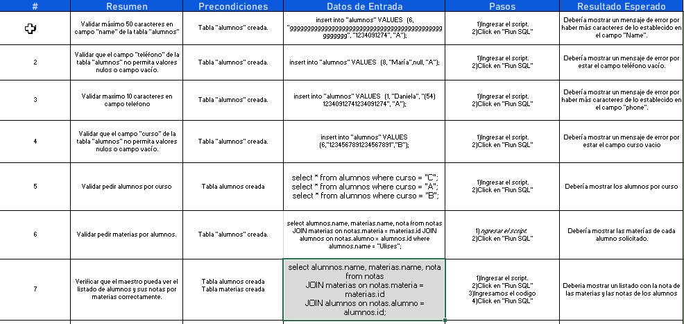
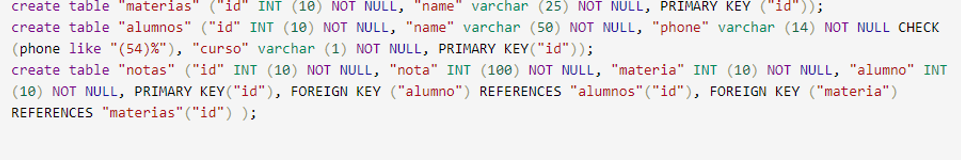
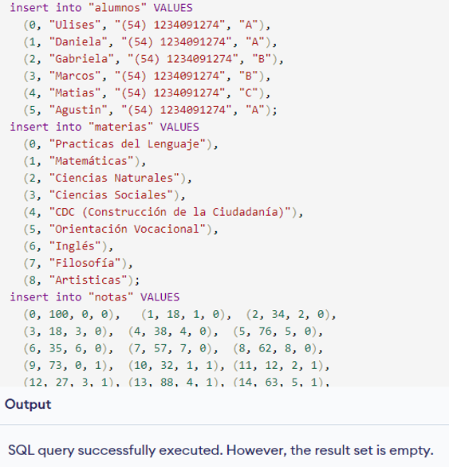
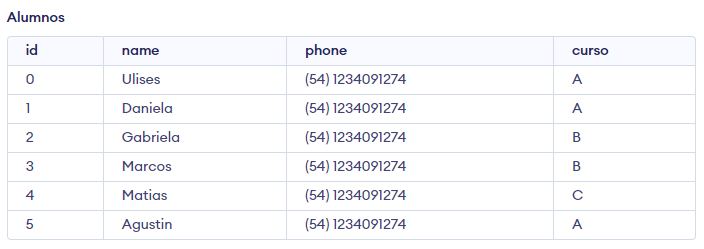
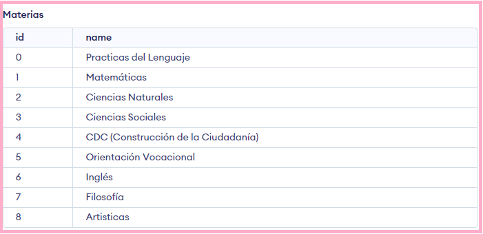
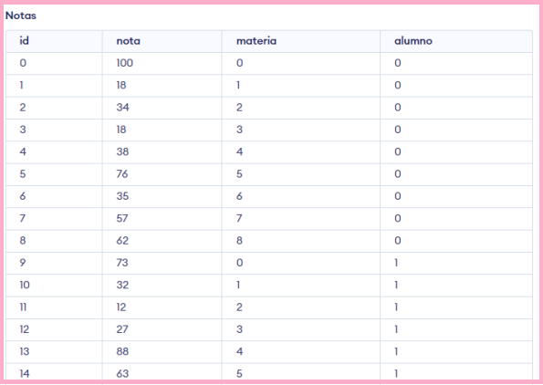
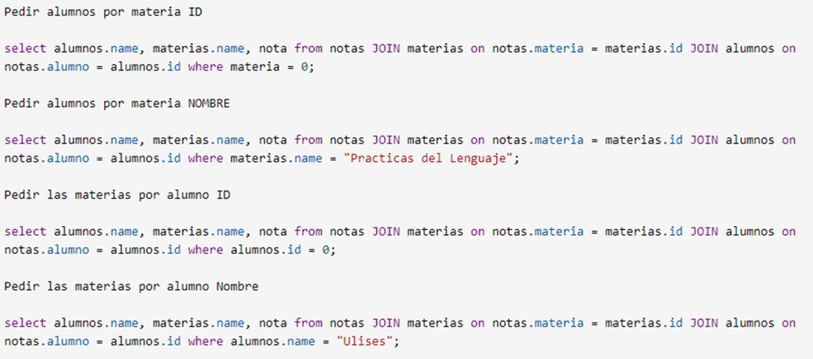
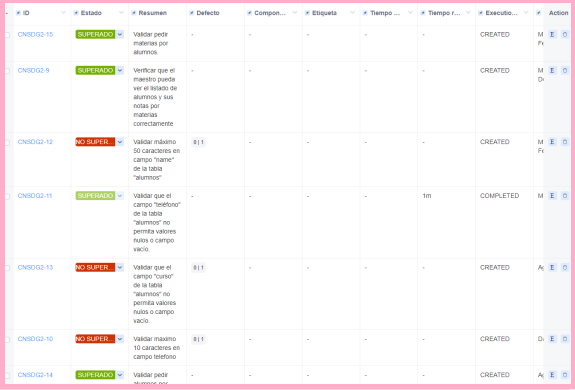

BB.DD: COLEGIO NUESTRA SEÑORA DE GUADALUPE.
-------------------------------------------
- >En este proyecto el cliente requeria una base de datos conformada por 3 tablas (Alumnos, Materias, Notas) con el fin de dar de alta a los alumnos, tambien para identificarlos por cursos y para que los profesores puedan visualizar las notas de cada alumno por materia.
- >Se trabajo bajo la metodología Scrum, dividiendo el trabajo en 2 sprint, a traves de la herramienta de gestión Jira y realizando un seguimiento de los test case a traves de Zephyr.    
  
  

  

***Se creó el diagrama EDR identificando: tablas, relaciones y claves PK y FK.***

***Matriz con los test case realizados.***

***Se crearon las 3 tablas a traves del diagrama de EDR realizado y con los datos proporcionados por el cliente.***

***Se puede observar los scripts utilizado,s para realizar las consultas, en los test case.***

***A traves del Cycle Summary podemos observar todo el ciclo de prueba con los test case superados y los que no lo hicieron.***

